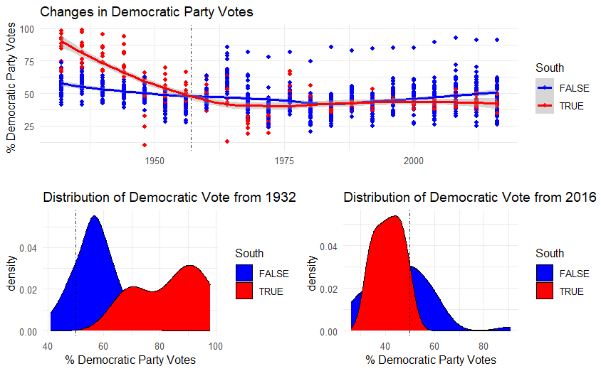

```{r , include=FALSE}
# This is a good place to put libraries required for using the ggplot function
knitr::opts_chunk$set(echo = TRUE)
library(tidyverse) #Loads the tidyverse package for ggplot
library(pscl) #Loads the pscl package for the dataset
library(gridExtra) #Allows us to combine ggplots into a nice layout

```

# Step-by-Step Image Building

In this lab, we will slowly construct the image below via `ggplot`. This chart was created using the `presidentialElections` dataset in the `pscl` package. These plots visually compare the historical change in the Democratic Vote between the former Confederate states and non-Confederate states.



You will need to modify the code chunks so that the code works within each of chunk. When you get the desired result for each step, change `eval=F` to `eval=T` and knit the document to HTML to make sure it works. Do not work out of order or skip around. After you complete the lab or by the end of class, you should submit your HTML file of what you have completed to Canvas.

For ease, we start by reassigning the dataset `presidentialElections` to a new variable called `PE`.

```{r}
PE=presidentialElections
```


# Part 1: Time Series Plot

### 1.1: Initiate Plot and Print (0 Points)
```{r,eval=T}
p1<-ggplot(data=PE) +
  geom_point(aes(x=year,y=demVote,color=as.factor(south)),size=2)
p1
```

### 1.2: Modify the Title and Labels (0 Points)

Use `xlab()`, `ylab()`, and `ggtitle()`.
```{r,eval=T}
p2<-p1+xlab("")+ylab("% Democratic")+ggtitle("USA Change in Democratic Vote")
p2
```

### 1.3: Get Smooth Curves and Print (1 Point)

Use `geom_smooth` similarly how we used `geom_point`.
```{r,eval=F}
p3<-p2+geom_smooth(COMPLETE)
p3
```

### 1.4: Modify the Legend Title and Print (0.5 Points)

Since the legend is for the color aesthetic we use `guides(color=guide_legend(title=COMPLETE_INSIDE))` to rename the legend.
```{r,eval=F}
p4<-p3+ COMPLETE
p4
```


### 1.5: Manually Select the Colors and Print (1 Point)

For the color aesthetic, we want to manually select the two different colors.
```{r,eval=F}
p5<-p4+ scale_color_manual(values=c("COLOR 1","COLOR 2"))
p5
```


### 1.6: Reference Line and Print (1 Point)

It doesn't seem to be until around 1957 where the non-Confederate states began to exceed the former Confederacy on approval for the Democratic party. We want to create a vertical line through the x-axis at 1957  using `geom_vline`. Check `?geom_vline` for more information about this geometric object.

For the color aesthetic, we want to manually select the two different colors.
```{r,eval=F}
p6<-p5+geom_vline(MISSING_OPTION,alpha=0.8,linetype=4)
p6
```

### 1.7: Modify the Theme and Print (0.5 Points)

Use `theme_minimal()` for the plot.
```{r,eval=F}
FINALPLOT1<-EDIT_INFORMATION
FINALPLOT1
```


# Part 2: Overlapping Density Curves in 1932 and 2016

### 2.1: Create Basic Density Plot (0 Points)

`PE$year` is a vector of all the years represented in the data for all states. `PE$year==1932`creates a vector of `TRUE` and `FALSE` where `TRUE` indicates observations from the year 1932. `PE[PE$year==1932,]` modifies the dataset to only include the data for the year 1932.

```{r,eval=T}
p1<-ggplot(data=PE[PE$year==1932,]) +
      geom_density(aes(x=demVote,fill=south))
p1
```

### 2.2: Modify Plot and Print (2 Points)

Modify the legend, titles, color, theme similarly to how we did the first plot. Also, add a vertical line at 50 which indicates the transition to a majority vote.

```{r,eval=F}
FINALPLOT2<-p1 + xlab(COMPLETE) + ylab(COMPLETE) + etc......
FINALPLOT2
```

### 2.3: Overlapping Density Curves in 2016 (2 Points)

Repeat the code that created **FINALPLOT2** for the year 2016. I advise copy and paste. 

```{r,eval=F}
FINALPLOT3<- .......
FINALPLOT3
```


# Part 3: Arrange All Plots in a Pleasant Layout

### 3.1: Arrange Images Into Grid (2 Points)

The `grid.arrange()` function from the `gridExtra` package allows us to do this. This needs to be done after all three plots are created. See if you can figure out what is going on. After knitting the document and observing the picture, change the code chunk option `fig.width=4` to `fig.width=8` and see what happens.

```{r,eval=F,fig.width=4}
#First Examine this Code and See What Happens

#Defaults to 1 Column Layout and Stacks Plots
grid.arrange(FINALPLOT1,FINALPLOT2,FINALPLOT3) 

#Starts Placing Plots in a Two Column Layout
grid.arrange(FINALPLOT1,FINALPLOT2,FINALPLOT3,ncol=2) 

#Now Check this Code Out: Try to Understand how the Matrix is Created and How the Layout is Controlled by the Matrix. Modify It to Get What I created
matrix(c(1,1,2,3),ncol=2)
LAYOUT=matrix(c(1,1,2,3),ncol=2)
grid.arrange(FINALPLOT1,FINALPLOT2,FINALPLOT3,layout_matrix=LAYOUT)
```


