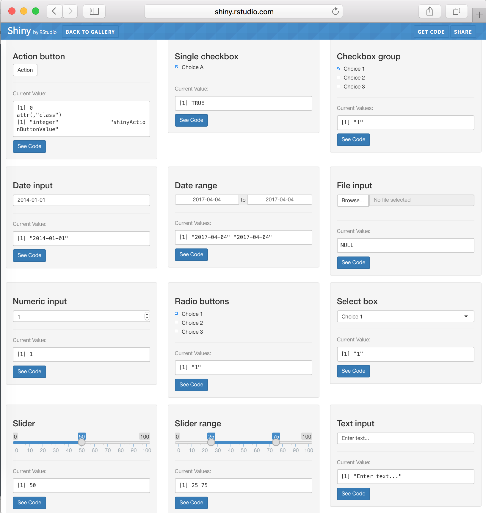
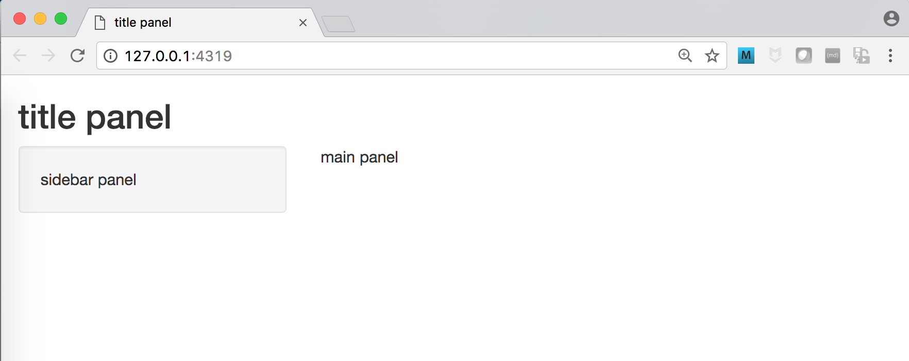
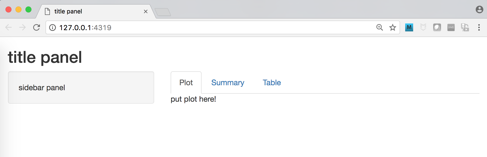
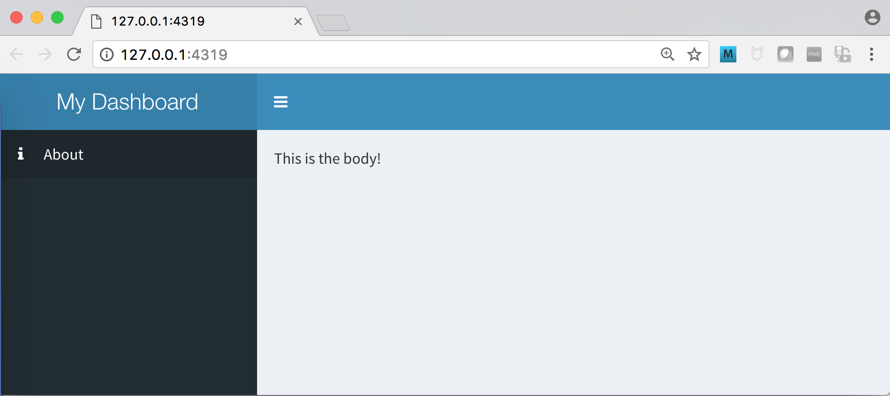

```{r setup, include=FALSE, warning=FALSE}
knitr::opts_chunk$set(echo = TRUE, eval = FALSE)
```


You can make interactive web applications easily and entirely in R with Shiny.
Shiny apps are a great way to share your analysis with others without them having to 
run any R themselves.


This lecture will cover 

- first Shiny app
- the basics of reactivity
- renderUI
- app layouts
- interactive visualization
- extra: 
    - DataTables
    - pdf/html/word generation
    - modules
    - hosting apps


# **Hello Shiny!**

Running the code below in the R console will start up a simple Shiny app that
plots a histogram and lets the user choose the number of bins in the histogram 
using a slider.  The code that powers the app is included, and relevant parts 
of the code will be highlighted yellow as you interact with the app.


```{r, eval=FALSE}
if (!require('shiny')) install.packages("shiny")
runExample("01_hello")
```


# **Key components of a Shiny app**

A Shiny app is composed of two fundamental parts:

- **ui** - This codes the __user interface__ that controls the layout and appearance of the app.
- **server** - This codes the computations and plots that show up in the user interface.

## File structure

These two parts can either be included in one file called **app.R** or 
in two separate files called **ui.R** and **server.R**.  Both methods work
equivalently, and it's a matter of preference which one you choose and may 
depend on if your app is very short or long.

This is the bare minimum code (it does nothing - a blank page shows up) 
if the app is on one **app.R** file:

```{r, eval=FALSE}
library(shiny)

ui <- fluidPage()

server <- function(input, output) {}

shinyApp(ui = ui, server = server)
```

For two separate files, **ui.R** will contain

```{r, eval=FALSE}
library(shiny)

shinyUI(fluidPage(
))
```

and **server.R** has

```{r, eval=FALSE}
library(shiny)

shinyServer(function(input, output) {
})
```

If the two files are stored in a directory called `my_app`, then you can run the
app with:

```{r, eval=FALSE}
runApp("my_app")
```

Extra: if you want your code to show up alongside your app like in the example, 
then change the display mode to `showcase`.

```{r}
runApp("my_app", display.mode = "showcase")
```


# **Basics of reactivity**

The coolness of Shiny apps comes from its use of reactivity.  This means that 
your apps come alive when you build reactive objects that interact with the user.

You construct a reactive object in two parts:

- **ui**: In the user-interface or ui part of your code, specify the type of object you want to include.
This can be an _input_ or _widget_ object like a checkbox, drop-down menu or even a spreadsheet, 
or an _output_ object like a plot, a table or just text display.
- **server**: In the server part of your code, you code this object up.


Here's the same example as before (with the histogram code rewritten with ggplot2).

In the **ui** section below, there is an input/widget object `sliderInput` that codes for 
a slider that the user can use to choose the number of bins in the histogram,
and there's an output object `plotObject` that displays the histogram.

In the **server** section below, the code that generates the histogram is 
returned in a `renderPlot` function that is saved to the `output` vector under
the same outputId `distPlot` as specified in `plotOutput`.  The user-supplied number of
bins from the slider is available in the `input` vector under the same inputId `bins`
as in `sliderInput`.

```{r, eval = TRUE}
library(shiny)
library(ggplot2)

ui <- fluidPage(
    
    # Sidebar with a slider input for the number of bins
    sidebarLayout(
        sidebarPanel(
            sliderInput(inputId = "bins",
                        label = "Number of bins:",
                        min = 1,
                        max = 50,
                        value = 30)
        ),
        
        # Show a plot of the generated distribution
        mainPanel(
            plotOutput(outputId = "distPlot")
        )
    )
    
)

server <- function(input, output) {
    
    # Expression that generates a histogram. The expression is
    # wrapped in a call to renderPlot to indicate that:
    #
    #  1) It is "reactive" and therefore should be automatically
    #     re-executed when inputs change
    #  2) Its output type is a plot
    
    output$distPlot <- renderPlot({
        
        ggplot(faithful, aes(x = waiting)) +
            geom_histogram(bins = input$bins, colour = "white")
        
    })
    
}

shinyApp(ui = ui, server = server,
         options = list(height = 500))
```


Below are tables of the possible input/output and render functions available to 
construct reactive objects in the app with.  

## UI input functions or Shiny widgets

Shiny widgets are web elements that enable your user to interact with the app.
There are several standard widgets available in Shiny.  You can play with them at the [Shiny widgets gallery](http://shiny.rstudio.com/gallery/widget-gallery.html).



| input function | widget |
|----------------|---------|
| actionButton | Action Button |
| checkboxGroupInput | A group of check boxes |
| checkboxInput | A single check box |
| dateInput | A pair of calendars for selecting a date range |
| fileInput | A file upload control wizard |
| helpText | Help text that can be added to an input form |
| numericInput |	A field to enter numbers |
| radioButtons |	A set of radio buttons |
| selectInput |	A box with choices to select from |
| sliderInput |	A slider bar |
| submitButton |	A submit button |
| textInput	| A field to enter text |

The first two arguments to a widget function is always

- **inputId**: Give an unique id to the widget so that the server side knows how to access it
- **label**: This is the text that shows up next to the widget to guide the user.

The rest of the arguments depend on the function of the widget.  For example, 
the `sliderInput` from the earlier example requires the setting of the
minimum and maximum value of the slider, as well as the value it should be set
as default when the user loads the app.

```{r}
sliderInput(inputId = "bins",
            label = "Number of bins:",
            min = 1,
            max = 50,
            value = 30)
```


## UI output functions

| output function | creates |
|-----------------|---------|
| htmlOutput | raw HTML |
| imageOutput | image |
| plotOutput | plot |
| tableOutput | table |
| textOutput | text |
| uiOutput | raw HTML |
| verbatimTextOutput | text |

The one required argument to an output function is the `outputId`, which helps
connect it to the render function on the server side that generates the output.  

On the **ui** side:

```{r}
plotOutput(outputId = "distPlot")
```

On the **server** side:

```{r}
output$distPlot <- renderPlot({
    
  [...put your plotting code here...]
    
})
```


## Server render functions

| render function | creates |
|-----------------|---------|
| renderImage | images |
| renderPlot | plots |
| renderPrint | any printed output |
| renderTable | data frame, matrix, other table like structures |
| renderText | character strings |
| renderUI | a Shiny tag object or HTML |


## renderUI 

One of the more powerful render functions is renderUI() - it enables us to 
generate dynamic UI, i.e. construct reactive objects that depend on user input. 
We illustrate how it works with a toy example that requires this function.

Let's say we are selecting colors for plotting in R, and we want to help the 
user narrow down the choices through color families.

If the user wants a red color, then the drop-down menu can display only the
red options.  We can't put a `selectInput` drop down menu in **ui** when we 
can't populate the choices argument with the correct list of colors that 
depend on what the user chooses in the `radioButtons`.  This means that we need 
to dynamically generate this `selectInput` inside `renderUI` (on the **server** side!)
based on the user-chosen color family `input$color_family`.


```{r, eval=TRUE}
library(shiny)

color_list <- list(red = c("tomato", "violetred", "firebrick"),
                   green = c("chartreuse", "forestgreen", "olivedrab"),
                   blue = c("navy", "dodgerblue", "torquoise"))

ui <- fluidPage(
    
    radioButtons(inputId = "color_family",
                 label = "Choose a color family",
                 choices = c("red", "green", "blue")),
    
    uiOutput(outputId = "color_selector"),
    
    verbatimTextOutput(outputId = "color_chosen")
    
)

server <- function(input, output) {
    
    output$color_selector <- renderUI({
        
        selectInput(inputId = "color",
                    label = "Select color",
                    choices = color_list[input$color_family])
        
    })
        
    output$color_chosen <- renderText({
        paste("You chose this color:", input$color)
    })
    
    
}

shinyApp(ui = ui, server = server,
         options = list(height = 300))
```


# **App layout**

Designing the layout of the user interface is a critical component of app 
development.  The goal is to make an app that is intuitive and friendly to use 
so people will actually want to use it!  This requires thoughtful planning
and lot of iterations as you test different layouts on your users.


## Basic layout


```{r}
library(shiny)

ui <- fluidPage(
    
    titlePanel("title panel"),
    
    sidebarLayout(
        sidebarPanel( "sidebar panel"),
        mainPanel("main panel")
    )
    
)

server <- function(input, output) {}

shinyApp(ui = ui, server = server)
```





## Basic layout with tabs

Another nice way to organize a layout is through tabs:


```{r}
library(shiny)

ui <- fluidPage(
    
    titlePanel("title panel"),
    
    sidebarLayout(
        sidebarPanel( "sidebar panel"),
        mainPanel(tabsetPanel(
            tabPanel("Plot", "put plot here!"),
            tabPanel("Summary"),
            tabPanel("Table")
        )
        )
    )
    
)

server <- function(input, output) {}

shinyApp(ui = ui, server = server)
```





## shinydashboard

A popular and easy way to create dashboard apps is with 
[shinydashboard](https://rstudio.github.io/shinydashboard/).

You need to specify three parts:

- header
- sidebar
- body

Here's the basic skeleton of how to specify these parts:

```{r}
library(shiny)
library(shinydashboard)

ui <- dashboardPage(
    dashboardHeader(),
    dashboardSidebar(),
    dashboardBody()
)

server <- function(input, output) { }

shinyApp(ui, server)
```

Here's an example with some parts filled out:

```{r}
library(shiny)
library(shinydashboard)

ui <- dashboardPage(
    dashboardHeader(title = "My Dashboard"),
    dashboardSidebar(
        sidebarMenu(
            menuItem("About", tabName = "about_tab", icon = icon("info"))
        )
    ),
    dashboardBody("This is the body!")
)

server <- function(input, output) { }

shinyApp(ui, server)
```





# **Dealing with data**

Now that we know how to set up an app, what are some ways to interact with data?

## global.R

Data can be loaded from files in a Shiny specific file called **global.R**.
Anything run in that file will be available in the global environment, which means
that both **ui.R** and **server.R** can access the variables and functions.

Things that you can typically include in **global.R**:

- reading in data files `my_data <- read_csv("data/my_data_file.csv")`
- loading packages `library(dplyr)`
- sourcing helper scripts `source(my_utils.R)`
- constant variables `my_colors <- c("orange", "blue")`
- helper functions that aren't Shiny reactive functions `calculate_percent <- function(...)`
- database connnections `db_conn <- dplyr::src_postgres(...db_credentials...)`


## Reactive expressions

Reactive expressions are a way for your app to update efficiently when users
interact with it.  They are a bit nuanced to use - here's the RStudio tutorial on them https://shiny.rstudio.com/tutorial/lesson6/. 

In general, any code you put in a `render` function will continually be updated, 
even if you don't necessarily need them to be rerun every single time.  This will
slow down your app considerably.  If you want to use data inside a `render` function
that does not need to be updated every time if `input` doesn't change, 
then you can wrap your data inside a reactive expression that can be called inside `render`.
The reactive expression will only recalculate if `input` has changed.

```{r, eval=TRUE}
library(shiny)

ui <- fluidPage(
    
    sliderInput(inputId = "rate",
                label = "Choose rate",
                min = 0,
                max = 1, 
                value = 0.5),
    
    textOutput(outputId = "pct_std"),
    
    textOutput(outputId = "pct_half")
    
)

server <- function(input, output) {
    
    my_percent <- reactive({
        input$rate * 100
    })
    
    my_half_percent <- reactive({
        my_percent() / 2
    })
    
    output$pct_std <- renderText({
        paste0("This is my percent: ", my_percent(), "%")
    })
    
    output$pct_half <- renderText({
        paste0("This is my percent by half: ", my_half_percent(), "%")
    })
    
}

shinyApp(ui = ui, server = server,
         options = list(height = 200))
```

- Reactive expressions depend on the status of `input` values or values from other reactive expressions.
- You can create reactive expressions with `reactive({})`.
- You can access a reactive expression with its name followed by `()`.
- You can only call a reactive expression within a `reactive` or `render` function.


# **Interactive visualization**


There are several well-developed packages for generating interactive
graphics in a Shiny app:

- [Shiny built-in support for interacting with static plots](https://shiny.rstudio.com/articles/plot-interaction.html)
- [plotly](https://plot.ly/)
- [Leaflet](https://rstudio.github.io/leaflet/shiny.html) for interactive maps
- [htmlwidgets for R](http://www.htmlwidgets.org/) - use JavaScript visualization libraries & [Crosstalk](http://rstudio.github.io/crosstalk/) - add-on to htmlwidgets
- [ggvis](http://ggvis.rstudio.com/interactivity.html)


```{r, eval=TRUE}
suppressMessages(library(plotly))
library(shiny)

ui <- fluidPage(
  plotlyOutput("plot"),
  verbatimTextOutput("hover"),
  verbatimTextOutput("click")
)

server <- function(input, output) {

  output$plot <- renderPlotly({
    plot_ly(x = rnorm(10), y = rnorm(10), z = rnorm(10), type = "scatter3d")
  })

  output$hover <- renderPrint({
    d <- event_data("plotly_hover")
    if (is.null(d)) "Hover events appear here (unhover to clear)" else d
  })

  output$click <- renderPrint({
    d <- event_data("plotly_click")
    if (is.null(d)) "Click events appear here (double-click to clear)" else d
  })

}

shinyApp(ui, server,
         options = list(height = 800))
```


```{r, eval = TRUE, include = FALSE}
library(shiny)

shinyApp(
  
  ui = fluidPage(
    selectInput("region", "Region:", 
                choices = colnames(WorldPhones)),
    plotOutput("phonePlot")
  ),
  
  server = function(input, output) {
    output$phonePlot <- renderPlot({
      barplot(WorldPhones[,input$region]*1000, 
              ylab = "Number of Telephones", xlab = "Year")
    })
  },
  
  options = list(height = 500)
)
```


# **More cool Shiny stuff**


## DataTables

The Javascript library DataTables provides very powerful functionality to 
working with data tables in a web browser.  Shiny apps can tap this through 
the R package [DT](https://rstudio.github.io/DT/) that interfaces with DataTables.  

Some of the useful things implemented are:

- selecting rows in the table
- search capabilities
- sorting columns
- filter columns
- showing user-specified number of rows
- styling such as highlighting and formatting

Here's a minimal example that you can run in the R console:

```{r, eval=TRUE}
suppressMessages(library(DT))
datatable(iris)
```

Here's how that table gets into a Shiny app:

```{r, eval=FALSE}
library(shiny)

ui <- fluidPage(
    DT::dataTableOutput('tbl')
)

server <- function(input, output) {
    output$tbl = DT::renderDataTable(
        iris
    )
}

shinyApp(ui, server)
```


## Dynamic document generation (pdf/html/word)

You can enable users to dynamically compile Rmarkdown into documents that he/she can then download.
For example, a scientist can choose an experiment from a table in an app, look at the
results in different kinds of plots, and then select certain plots to be included in 
an official report generated by the app.

Here's a working example that takes a name and uses that as the author of a report.  
You'll notice that it needs a rmarkdown template to fill in the user inputs and compile.
The header of the file `report.Rmd` looks like:

```{r}
---
title: "My Report"
author: "`r input$user_name`"
date: "`r format(Sys.time(), '%B %d, %Y')`"
output: html_document
---
```


```{r, eval=TRUE}
library(shiny)
library(rmarkdown)

ui <- fluidPage(
    
    textInput(inputId = 'user_name',
              label = 'Name'),
    
    radioButtons(inputId = 'format', 
                 label = 'Run Report Format', 
                 c('PDF', 'HTML', 'Word'),
                 inline = TRUE),
    
    downloadButton('generate_report')
    
)

server <- function(input, output) {
    
    output$generate_report <- downloadHandler(
        
        filename = function() {
            
            paste0("my_report", ".",
                   switch(
                       input$format, PDF = 'pdf', HTML = 'html', Word = 'docx'
                   ))
            
        },
        
        content = function(file) {
            
            markdownFile <- 'report.Rmd'
            src <- normalizePath(markdownFile)

            owd <- setwd(tempdir())
            on.exit(setwd(owd))
            file.copy(src, markdownFile, overwrite = TRUE)

            out <- render(markdownFile, switch(
                input$format,
                PDF = pdf_document(), HTML = html_document(), Word = word_document()
            ))
            file.rename(out, file)
            
        }
    )
    
}

shinyApp(ui = ui, server = server,
         options = list(height = 300))
```


## Shiny modules

Large and complex Shiny apps will have many many lines of code.  Having it all
in just one or two files can get very disorganized and unreadable. Just like how we modularize reusable R code into functions, we can modularize Shiny code into [Shiny modules](https://shiny.rstudio.com/articles/modules.html)!

You can construct a Shiny module with two functions - one for the UI and one for the
server.  

This lecture won't go into detail on how it works - it can get complicated but
here's a simple module that will function if you run it.

Some key points:

- `linkedScatter` is the module - `linkedScatterUI()` specifies the UI, `linkedScatter()` specifies the server part of the module (this requires the `session` argument after `input` and `output`).
- You use `callModule()` to call the module in the main server part.
- Object ids need to be wrapped with the namespace function (`NS()`) in the module so that it enforces unique ids across the entire app.
- You can return things with a module and supply it as an input into another module.

```{r, eval=TRUE}
library(shiny)

linkedScatterUI <- function(id) {
    ns <- NS(id)
    
    fluidRow(
        column(6, plotOutput(ns("plot1"), brush = ns("brush"))),
        column(6, plotOutput(ns("plot2"), brush = ns("brush")))
    )
}

linkedScatter <- function(input, output, session, data, left, right) {
    # Yields the data frame with an additional column "selected_"
    # that indicates whether that observation is brushed
    dataWithSelection <- reactive({
        brushedPoints(data(), input$brush, allRows = TRUE)
    })
    
    output$plot1 <- renderPlot({
        scatterPlot(dataWithSelection(), left())
    })
    
    output$plot2 <- renderPlot({
        scatterPlot(dataWithSelection(), right())
    })
    
    return(dataWithSelection)
}

scatterPlot <- function(data, cols) {
    ggplot(data, aes_string(x = cols[1], y = cols[2])) +
        geom_point(aes(color = selected_)) +
        scale_color_manual(values = c("black", "#66D65C"), guide = FALSE)
}


ui <- fixedPage(
    h2("Module example"),
    linkedScatterUI("scatters"),
    textOutput("summary")
)

server <- function(input, output, session) {
    df <- callModule(linkedScatter, "scatters", reactive(mpg),
                     left = reactive(c("cty", "hwy")),
                     right = reactive(c("drv", "hwy"))
    )
    
    output$summary <- renderText({
        sprintf("%d observation(s) selected", nrow(dplyr::filter(df(), selected_)))
    })
}

shinyApp(ui, server,
         options = list(height = 600))
```


## Hosting apps 

Once you've made your awesome Shiny app, how do you share it with world or at 
least the people you've designed it for? Remember that apps are great because
the user does not need to download and install R or know any R code whatsoever 
to be able to use them.  But this means that the app has to be hosted somewhere 
that does have R, shiny, and all the required packages installed.  

The easiest way to host your app is to have RStudio host it for you at [https://www.shinyapps.io/](https://www.shinyapps.io/).  The pros are that you
don't have to worry about any IT infrastructure in maintaining your own server;
but if your app processes sensitive or confidential data or you don't want the
public to be able to access it, then you either have to pay RStudio for more 
capabilities over the free version or deploy apps yourself with [Shiny Server](https://www.rstudio.com/products/shiny/shiny-server/) - locally or on the cloud.


# **Additional materials**

* [RStudio Shiny Cheatsheet](https://www.rstudio.com/wp-content/uploads/2016/01/shiny-cheatsheet.pdf)
* [RStudio Teach Yourself Shiny](https://shiny.rstudio.com/tutorial/)
* [RStudio Webinar - How to start with Shiny – Part 1](https://www.rstudio.com/resources/webinars/how-to-start-with-shiny-part-1/)
* [RStudio Shiny Examples](https://github.com/rstudio/shiny-examples)
* [Show Me Shiny App Gallery](https://www.showmeshiny.com/)
* [Building Shiny apps - an interactive tutorial](http://deanattali.com/blog/building-shiny-apps-tutorial/)
* [RStudio Reactivity Tutorial](https://github.com/rstudio/reactivity-tutorial)
* [Plotly Shiny Gallery](https://plot.ly/r/shiny-gallery/)
* [Persistent data storage](https://shiny.rstudio.com/articles/persistent-data-storage.html)
* [RStudio Reactivity Overview](https://shiny.rstudio.com/articles/reactivity-overview.html)
* [RStudio Understanding Shiny Modules Webinar](https://www.rstudio.com/resources/webinars/understanding-shiny-modules/)


