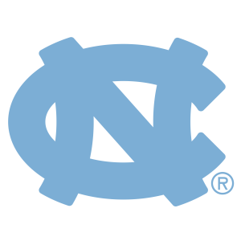

This course is an application-driven introduction to data science. Statistical and computational tools are valued throughout the modern workplace from Silicon Valley startups, to marine biology labs, to Wall Street firms. These tools require technical skills such as programming and statistics. They also require professional skills such as communication, teamwork, problem solving, and critical thinking.

  

- Instructor: **[Mario Giacomazzo](http://www.supermariogiacomazzo.com/)**

- Instructional Assistants: 
    - **[Pavlos Zoubouglou](http://stat-or.unc.edu/people/graduate-students-department)**
    - **[Peter Lin](http://stat-or.unc.edu/people/graduate-students-department)**
    

- Course Syllabus: **[Section 1](https://drive.google.com/file/d/1YOGDAWKjznaFnUW7uZO8nciixMZO9XY5/view?usp=sharing)**

- Zoom Links:
    - **[Lectures:](https://unc.zoom.us/j/98063448751)** Daily from 11:30AM to 1PM
    - **[Dr. Mario Office Hours:](https://unc.zoom.us/j/94479071959)** 30 Min Before and After Class 
    - **[Pavlos Office Hours:](https://unc.zoom.us/j/2903979720)** Daily from 8AM to 9AM
    - **[Peter Office Hours:](https://unc.zoom.us/j/631940383)** Daily from 2:30PM to 3:30PM

  

  

  
  

 

# **Course Material**

| Date | Lecture | Slides | Tutorial |
|------|---------|--------:|---------:|
|Jun. 22| [Introduction](https://unc.zoom.us/rec/share/_s0lEbTx1UxJe43c6HPPXqIZToWmX6a803Ab_fpcnkhFwSeeGyKuyXTyInuxKtap?startTime=1592839447000) | [Slides](https://drive.google.com/file/d/1atF84I-_13yvKfzxfNS-XjECwWzrND21/view?usp=sharing)||
|| [Data Visualization](https://unc.zoom.us/rec/share/_s0lEbTx1UxJe43c6HPPXqIZToWmX6a803Ab_fpcnkhFwSeeGyKuyXTyInuxKtap?startTime=1592839447000) | [Slides](https://drive.google.com/file/d/1TAZ9vnNm-Nz3Aw-GCHfOC0RpmkRus39Z/view?usp=sharing) | [Tutorial](Tutorial/Data Visualization/Tutorial.html) ([.Rmd](https://drive.google.com/file/d/1e0ThTHdZzxsWWg5PI-dG-IURkN1P-bPg/view?usp=sharing)) |
|Jun. 23|[Workflow in RMarkdown](https://unc.zoom.us/rec/share/190kd7b08UdLY6fMsVOGf4M5ErzKT6a80yUZ86EKzx0mSrhHzQMq4P0QqsWh78Cg?startTime=1592925686000)|[Slides](https://drive.google.com/file/d/1DDl31rRmNHJ17GCIKuLvGpkymxF8uayH/view?usp=sharing)| [Tutorial](Tutorial/Workflow/Tutorial.html) ([.zip](https://drive.google.com/file/d/1bLEU0GucAtlX4-VXUydwkesuW3d0pEVB/view?usp=sharing))|
|Jun. 24| [Data Transformation I](https://unc.zoom.us/rec/share/75JZdZjq0TxLEpXJ90LTS_8dAIDUX6a8hCJMqaFez0jtPTOr8mGXciULNnyMOAVU?startTime=1593012299000) |[Slides](https://drive.google.com/file/d/16N-lYhh0tn2J4SfUBXeVcLvffiAMll56/view?usp=sharing)||
|| [Data Transformation II](https://unc.zoom.us/rec/share/75JZdZjq0TxLEpXJ90LTS_8dAIDUX6a8hCJMqaFez0jtPTOr8mGXciULNnyMOAVU?startTime=1593012299000) |[Slides](https://drive.google.com/file/d/1dKHDweumhPHaybDO9Q_gFAMEbSfwwWkQ/view?usp=sharing)|[Tutorial](Tutorial/Data Transformation 2/Tutorial.html) ([.Rmd](https://drive.google.com/file/d/1sqkoYplrob0I7igiW_tB_L2zHzRy_P5N/view?usp=sharing))|
|Jun. 25| [Data Transformation III](https://unc.zoom.us/rec/share/95FMJeDX5kVOebfM8ALUdZR-HKD7aaa82ygWrvANyUwjhoLGSwjRQ0AmxNfBvwzo?startTime=1593097312000) |[Slides](https://drive.google.com/file/d/1kUU2hO2YLJUrrNOv4Uy7tOK8GZcPGqL7/view?usp=sharing)||
|| [Data Transformation IV](https://unc.zoom.us/rec/share/95FMJeDX5kVOebfM8ALUdZR-HKD7aaa82ygWrvANyUwjhoLGSwjRQ0AmxNfBvwzo?startTime=1593097312000) |[Slides](https://drive.google.com/file/d/1UGMfheOImYQt63gJ0D_rdLKrlgTQZOjK/view?usp=sharing)|[Tutorial](Tutorial/Data Transformation 2/Tutorial.html) ([.zip](https://drive.google.com/file/d/1CbVYRmSw7vZua-9ppvsgtcLKuAjhRf-f/view?usp=sharing))|
|Jun. 26| [Exploratory Data Analysis I](https://unc.zoom.us/rec/share/vPwlLY7a8F9OeJXXtB72ZLM-WaHpaaa8h3Adr_EKzE1Tl_ndp6zeHEthF3hQpAhg?startTime=1593184525000) |[Slides](https://drive.google.com/file/d/1cwBrbCBpG0nvmcfXrlrpHT5BxREVjr0P/view?usp=sharing)||
|| [Exploratory Data Analysis II](https://unc.zoom.us/rec/share/vPwlLY7a8F9OeJXXtB72ZLM-WaHpaaa8h3Adr_EKzE1Tl_ndp6zeHEthF3hQpAhg?startTime=1593184525000) |[Slides](https://drive.google.com/file/d/1HV2oJ5a_dVLBoSCctZr1ir8wzIgoMGVq/view?usp=sharing)|[Tutorial](Tutorial/Exploratory Data Analysis 2/Tutorial.html) ([.Rmd](https://drive.google.com/file/d/1NQ5QuKC7ZzaajFkGH39_y-H9gMrAmgjZ/view?usp=sharing))||
|June 29| [Final Project I](https://unc.zoom.us/rec/share/1_ROAe31_F1LXrfs1UXDCoM_T4vkaaa82ycc_6EIzUqDIAV2wmzla9ix7KMmcLQx?startTime=1593444156000) |[Slides](https://drive.google.com/file/d/1VRTM5jW8TjjWHMcizNjjA0ewemwNvyuC/view?usp=sharing)||
|| [Data Import](https://unc.zoom.us/rec/share/1_ROAe31_F1LXrfs1UXDCoM_T4vkaaa82ycc_6EIzUqDIAV2wmzla9ix7KMmcLQx?startTime=1593444156000) |[Slides](https://drive.google.com/file/d/15KvLv179xjfvYSMuoGDKmwicuT0F2UKG/view?usp=sharing)||
|June 30| [Tidy Data I](https://unc.zoom.us/rec/share/4ZVEBrPLrFxIRc-Vx0zkZfAZHrvZaaa8gCJN_voFyR4-EolWh6xZ8rTlm45BPLfs?startTime=1593530655000) |[Slides](https://drive.google.com/file/d/1U-TRjdBEHXaU_Q52Xunkxpd0Yie9oZdn/view?usp=sharing)||
|| [Tidy Data II](https://unc.zoom.us/rec/share/4ZVEBrPLrFxIRc-Vx0zkZfAZHrvZaaa8gCJN_voFyR4-EolWh6xZ8rTlm45BPLfs?startTime=1593530655000) |[Slides](https://drive.google.com/file/d/1WTsPbnuezz_1ZxI35LwwXPJL7VYlzK8G/view?usp=sharing)|[Tutorial](Tutorial/Tidy Data 2/Tutorial.html)  ([.Rmd](https://drive.google.com/file/d/1C0p16A8v5NkGio6lKpP6kDxdfjA0X9cq/view?usp=sharing))|
|Jul. 1| [Web Scraping I](https://unc.zoom.us/rec/share/95U2EK_Z3TlIUKfnwgKGZPAFAo7caaa8gCYe-KJZnh10uopZ1uhhdR-UcEm_Ngkr?startTime=1593617143000) |[Slides](https://drive.google.com/file/d/1hSfA_YS7WhV-hkfXhz-_eVWVY6zt5fil/view?usp=sharing)|[Tutorial](Tutorial/Web Scraping 1/Tutorial.html)  ([.Rmd](https://drive.google.com/file/d/1H_rEai7Y9dG5C1Papo-zsgvek8SzE2-M/view?usp=sharing))|
|| [Web Scraping II](https://unc.zoom.us/rec/share/95U2EK_Z3TlIUKfnwgKGZPAFAo7caaa8gCYe-KJZnh10uopZ1uhhdR-UcEm_Ngkr?startTime=1593617143000) |[Slides](https://drive.google.com/file/d/10WIwlmZuRakieBpIhg5MGLjodeOLIpCR/view?usp=sharing)|[Tutorial](Tutorial/Web Scraping 2/Tutorial.html)  ([.zip](https://drive.google.com/file/d/1r76UjOcWSUC_pcNj6LNvXDdKioZCTqeK/view?usp=sharing))|
|Jul. 2|Group Work Day|||
|Jul. 3|Fireworks Eve|||
|Jul. 6| [Joins I](https://unc.zoom.us/rec/share/7slUaL3U3HxIZaf16WjkBLQFO9vqeaa81HNKr6EEyE1JfmI5HQC4MbcQKXIuoFWp ) |[Slides](https://drive.google.com/file/d/1M88xOe34SWkbm7lCQMNX6RQAm_mhCEjk/view?usp=sharing)||
|| [Joins II](https://unc.zoom.us/rec/share/7slUaL3U3HxIZaf16WjkBLQFO9vqeaa81HNKr6EEyE1JfmI5HQC4MbcQKXIuoFWp ) |[Slides](https://drive.google.com/file/d/1wgEmOgwbjbnZbIBaHSiRg_tAbuumAS9I/view?usp=sharing)||
|Jul. 7| [Final Project II](https://unc.zoom.us/rec/share/3MV3IPbTxDJOSaP90X3YXLUTGbq0eaa823VL-PoPxU-PDKzvtrcLEdoCftC67DPs ) |[Slides](https://drive.google.com/file/d/1dnBkv6iKBgP2O0hTEJ9YQ-A2Kd8c-0a_/view?usp=sharing)||
|| [Factors](https://unc.zoom.us/rec/share/3MV3IPbTxDJOSaP90X3YXLUTGbq0eaa823VL-PoPxU-PDKzvtrcLEdoCftC67DPs ) |[Slides](https://drive.google.com/file/d/1BuLCYOoCn779L9sr4JwgTbh9QiqBJ38P/view?usp=sharing)||
|Jul. 8| [Programming I](https://unc.zoom.us/rec/share/y5NSdOys8FxLGpWQ5gLyfKIgD6n3eaa80HQerPZfnRsdzL35Jui30GE2m8Yo0sne ) |[Slides](https://drive.google.com/file/d/1DmCKrAvXzTvDQ3x3KN1xCtMxzcrZsgBH/view?usp=sharing)|[Tutorial](Tutorial/Programming 1/Tutorial.html) ([.Rmd](https://drive.google.com/file/d/1mjCIq_f64-G_nNAnqUkZQRHQhDlXS_iM/view?usp=sharing))|
|| [Programming II](https://unc.zoom.us/rec/share/y5NSdOys8FxLGpWQ5gLyfKIgD6n3eaa80HQerPZfnRsdzL35Jui30GE2m8Yo0sne ) |[Slides](https://drive.google.com/file/d/1et9VIGvGjLOQ5dXc8cxJkFWRNkH_YCmU/view?usp=sharing)|[Tutorial](Tutorial/Programming 2/Tutorial.html) ([.Rmd](https://drive.google.com/file/d/1t5LYZnGtC3q-4Mbgx9FDkXw0l-E2nijR/view?usp=sharing))|
|Jul. 9| [Programming III](https://unc.zoom.us/rec/share/9JcsHZvT60ROUtad0FvdVZx_PYrueaa81ilP8qcMyRydVuBaI3t5Px_IfUU12zhb ) |[Slides](https://drive.google.com/file/d/1AWk4fcXrVkM4Xm_GxEPrYwONXGpKvCxw/view?usp=sharing)|| -->
|| [Programming IV](https://unc.zoom.us/rec/share/9JcsHZvT60ROUtad0FvdVZx_PYrueaa81ilP8qcMyRydVuBaI3t5Px_IfUU12zhb ) |[Slides](https://drive.google.com/file/d/1Sptc4vvRs5MfCgr_uqRS1NHX6fkD0-Wl/view?usp=sharing)||
|Jul. 10|[Modeling I](https://unc.zoom.us/rec/share/181HHaOvtVtLWNKRsWjPRocgLIT9X6a8gCAX8vILn0YopgBejo2cNKx9rr_RzBDl?startTime=1594394985000)|[Slides](https://drive.google.com/file/d/1HsXbt9c5GFkSv8sRTC5XlTL_4Q8b44dT/view?usp=sharing)||
|Jul. 13|[Modeling II](https://unc.zoom.us/rec/share/w-9wJp7I7F1JaY3S0VjWGahmE5voeaa82ycYrqdfy0e6kdg5_QLfGKIO4ljwdgCA?startTime=1594653925000)|[Slides](https://drive.google.com/file/d/1uKhequdrElCylMVL33G7DA1Bc-z3kHIq/view?usp=sharing)|[Tutorial](Tutorial/Modeling 2/Tutorial.html) ([.zip](https://drive.google.com/file/d/13Gr4khQHj5xwf7bF0ixxCgRjs4z69S_z/view?usp=sharing))|
||[Modeling III](https://unc.zoom.us/rec/share/w-9wJp7I7F1JaY3S0VjWGahmE5voeaa82ycYrqdfy0e6kdg5_QLfGKIO4ljwdgCA?startTime=1594653925000)|[Slides](https://drive.google.com/file/d/1N9lLVOSXYImIIgKVYfHY0STJ076WczxV/view?usp=sharing)|[Tutorial](Tutorial/Modeling 3/Tutorial.html) ([.zip](https://drive.google.com/file/d/1w92U22YHiUd9agVaQuKnweirOwrLIOj-/view?usp=sharing))|
|Jul. 14|[Modeling IV](https://unc.zoom.us/rec/share/4PNrda6rqFpIf43h80zvdY4_IaX1T6a82yQe_aBfxBlER8kJp6VZl8TEkWbLEdIX )|[Slides](https://drive.google.com/file/d/17mIXSqjMvuVLIYLrNhpNeuqMorcfYwUd/view?usp=sharing)|[Tutorial](Tutorial/Modeling 4/Tutorial.html) ([.zip](https://drive.google.com/file/d/1f8D4xLKPwavJWy93d5DDJU2yr1B6gPt4/view?usp=sharing))|
|Jul. 15|[Modeling V](https://unc.zoom.us/rec/share/_-gvF7PS6CBLWKPO43zNc5cfR5i9T6a8gCMX-KIOn04QxljCoEE6tZkdZBkfOX96)|[Slides](https://drive.google.com/file/d/12o1WJNz6uSfLbl-_V2ITamxfhgLEJydM/view?usp=sharing)||
|Jul. 16|[Modeling VI](https://unc.zoom.us/rec/share/zvdyN-Cprk9JHKfjtGfgVLQcL6O7eaa8gylLrKYLnh1IPZ0vAw8C7pef9ZqIVdBT)|[Slides](https://drive.google.com/file/d/1-yDT0up68BCgNpU3r5pSFOFeJ5Mejpuz/view?usp=sharing)||
|Jul. 17|[Modeling VII](https://unc.zoom.us/rec/share/5JZtEIrs-j5Iftb9znDHVfAiFJ7ieaa81CYWrKcExUmvQafA6sKHIU6s52GkCO_T)|[Slides](https://drive.google.com/file/d/1Bi04Ytc6JqXkUcU7C-MeeOGtUK9Tr5cd/view?usp=sharing)|[Tutorial](Tutorial/Modeling 7/Tutorial.html) ([.Rmd](https://drive.google.com/file/d/1NXGQgiXSe8zP9e-bXhm0oSNuud96JYZo/view?usp=sharing))|
|Jul. 20|[Modeling VIII](https://unc.zoom.us/rec/share/tNRYJa_Jy29OE9bvs3_WeKEcRZb_T6a80HAc_PNcmRuInUviNRYtKjYeNUgwBRzu )|[Slides](https://drive.google.com/file/d/1zp-zG4ii5PZdlpaq95v5S9MO5LsEXh1X/view?usp=sharing)|[Tutorial](Tutorial/Modeling 8/Tutorial.html) ([.Rmd](https://drive.google.com/file/d/1kAvZvjiPmvcya91-cW-nAHZez-rjV2ZK/view?usp=sharing))|
||[Modeling IX](https://unc.zoom.us/rec/share/tNRYJa_Jy29OE9bvs3_WeKEcRZb_T6a80HAc_PNcmRuInUviNRYtKjYeNUgwBRzu )|[Slides](https://drive.google.com/file/d/1DgDOKe2Nj8hqZJCUAlYeatb0mGtGqeGC/view?usp=sharing)|[Tutorial](Tutorial/Modeling 9/Tutorial.html) ([.Rmd](https://drive.google.com/file/d/11HqvjhKyHWr7TdSRMx8yteHhfESd-hrk/view?usp=sharing))|
|Jul. 21|Group Work Day|||
|Jul. 22| [Data Ethics](https://unc.zoom.us/rec/share/7scyBrfS-TxLUon32U6HXYkuH43Zaaa8gykf-vNfyUj2-6Y1RPWnVg1KTo-RHSBJ ) |[Slides](https://drive.google.com/file/d/1Hji5bw9x9NsjUuOL2qUVAr4nfbc3dn74/view?usp=sharing)||
|Jul. 23|[R Shiny](https://unc.zoom.us/rec/share/_pFMHuj1xlNOEs_y2hHOQ_c5PLnhT6a8gXIWqKYPyk7x2yez_d4C8hLcphl-7Ppj)|[Slides](https://drive.google.com/file/d/1tzDNVSmNEsfajomAzeyKbN-zMWp0LXZp/view?usp=sharing)|[Tutorial](https://drmariogiacomazzo.shinyapps.io/Gapminder_Part3/) ([.zip](https://drive.google.com/file/d/1psNB-HGjdZoW-kWb2nWZHe6WDTtHno1P/view?usp=sharing))|||||
|Jul. 27|Final Presentations|||

# **Assignment Tracker**

All Lab and Analysis assignments are to be submitted via **[Sakai](https://sakai.unc.edu/welcome/)**. 

| Assigned | Lab (L) | Analysis (A) |Solutions| Due Date (Time) |
|----------|:--------:|:-------------:|:-------------:|----------------:|
| June 22  | [L1](Lab/Lab 1/Lab-1.html) ([.Rmd](https://drive.google.com/file/d/18x6JIRsASRmar21fNFcCz5u4tZdhJga8/view?usp=sharing))||[L1](Solutions/Lab_1_Solutions.html) |June 24 (5 PM) |
| June 24 | [L2](Lab/Lab 2/Lab-2.html) ([.Rmd](https://drive.google.com/file/d/1A3v6XoatscGa5WE9K-rDAlKOiETtlN06/view?usp=sharing))||[L2](Solutions/Lab_2_Soln_TK.html)|June 26 (5 PM) |
| June 26 || [A1](Analysis/Analysis 1/Analysis-1.html) ([.zip](https://drive.google.com/file/d/1AqSqbBKYw7Zn2nD0r3QWfYN2q-z7EXMi/view?usp=sharing))|[A1](Solutions/Solutions-1.html)|June 29 (5 PM) |
| June 29 | [L3](Lab/Lab 3/Lab-3.html) ([.Rmd](https://drive.google.com/file/d/1VA1nwnJxm1usbB-jVv3v2YefTc_j4IbO/view?usp=sharing))||[L3](Solutions/Lab_3_Solutions.html)|July 1 (5 PM)|
| July 1 | [L4](Lab/Lab 4/Lab-4.html) ([.Rmd](https://drive.google.com/file/d/1EvKorkEPsFKCpWLYEncqD_O4ZIEfI4nb/view?usp=sharing))||[L4](Solutions/Lab_4_Solutions.html)|July 6 (5 PM)|
| July 6|| [A2](Analysis/Analysis 2/Analysis-2.html) ([.zip](https://drive.google.com/file/d/11NkA0vLzi46SX6w_j7smUQaBDo-fQyny/view?usp=sharing))|[A2](Solutions/Solutions-2.html)|July 8 (5 PM)|
| July 8 | [L5](Lab/Lab 5/Lab-5.html) ([.Rmd](https://drive.google.com/file/d/1MflNYSHEUxm5IvoFf950pejj4mTROJmR/view?usp=sharing))||[L5](Solutions/Lab_5_Soln_TK.html)|July 10  (5 PM)|
| July 10 || [A3](Analysis/Analysis 3/Analysis_3.html) ([.zip](https://drive.google.com/file/d/1lOhwRmbwlgWfEnXO_M-MOVp0dH8afDG6/view?usp=sharing))|[A3](Solutions/Solutions_3.html)|July 13 (5 PM)|
| July 13  | [L6](Lab/Lab 6/Lab-6.html) ([.Rmd](https://drive.google.com/file/d/1GPfHPQLhrCayiaO3kmGkVCPjAyAicl1C/view?usp=sharing)) ||[L6](Solutions/Lab_6_Solutions.html)|July 15 (5 PM)|
| July 15 | [L7](Lab/Lab 7/Lab-7.html) ([.Rmd](https://drive.google.com/file/d/1_-m7iz9Ju8oXbrXd4bwN1IvtnMBiyHu4/view?usp=sharing)) ||[L7](Solutions/Lab_7_Solutions.html)|July 17 (5 PM)|
| July 17   |        |  [A4](Analysis/Analysis 4/Analysis_4.html) ([.zip](https://drive.google.com/file/d/15u5o6GNvOp9ubbmuMCs8pchWwYRDYu_j/view?usp=sharing))||July 20 (5 PM)|
|          |        |             |           |

# **Final Project Details**

For the final project, each section of STOR 320 will be divided (ideally) into reasearch groups of size 5. To ensure fairness, students will be assigned randomly based on the `sample` function in **R**. If you don't get in a group you like, try being better at luck.

## Research Group Assignments

To find your research group, see the **[spreadsheet](https://docs.google.com/spreadsheets/d/1fJj80X_zaLh3nv-u63HtT_U930GDizc4xJXFo-wSAPA/edit?usp=sharing)** sponsored by Google.

## Four Roles

Although everyone is responsible for the entire project, each member of the group will be assigned a specific role for accountability and consistency. These four specific roles are described as follows:

- **The Creator:** Schedule and Meet with Dr. Mario to Propose Your Group's Research Idea, Lead Designer in Slides

- **The Interpreter:** Schedule and Meet with Dr. Mario to Share Findings from Exploratory Analysis, Evaluate Practice Presentation

- **The Orator(s):** Give a Captivating 3-5 Minute Slideshow Presentation During Final Exam Day

- **The Deliverer:** Deliver Your Group from Evil by Editing and Submitting the Exploratory Analysis and Final Written Paper via SAKAI Before the Deadline

## Four Parts Including Point Values

This final project will be divided into four parts worth a total of 100 points. Each part will have a clear rubric as non-subjective as possible. The parts along with total point values are found below:

* **[P1: Project Proposal](Final Project/Project-Proposal.html)** *(10 Points)*
    + [Template](Final Project/Project-Proposal-Template.html)([.Rmd](https://drive.google.com/file/d/1m5pgDs0NvqdgSMkMR18OCWL6l1egqqYm/view?usp=sharing))
    + [Data World](https://data.world/)
    + [US Government Data](https://www.data.gov/)
    + [Kaggle](https://www.kaggle.com/)
    + [Free Data Info I](https://www.forbes.com/sites/bernardmarr/2016/02/12/big-data-35-brilliant-and-free-data-sources-for-2016/#63f06f60b54d)
    + [Free Data Info II](https://r-dir.com/reference/datasets.html)

* **[P2: Exploratory Data Analysis](Final Project/Exploratory_Data_Analysis.html)** *(20 Points)*
    + [Template](Final Project/EDA-Template.html) ([.Rmd](https://drive.google.com/file/d/1zNI0hX9CTg9d77mHOKxebgdwDEmqYebf/view?usp=sharing))
    
* **[P3: Final Written Paper](Final Project/Final_Paper.html)** *(40 Points)*
    + [Template](Final Project/Final-Paper-Template.html)([.Rmd](https://drive.google.com/file/d/19oG11IaUnAkPe8BUE7SAXS2BOeVLIZdT/view?usp=sharing))
    + [Group Scoring](https://forms.gle/T9dmCLGQfxfKbVej8)
    
* **[P4: Final Presentation](Final Project/Final_Presentation.html)** *(30 Points)*

    
## Due Dates of Individual Parts

| Part | Description |Method of Submission| Due Date (Time) |
|------|-------------|-------------------|----------------:|
| P1  | Project Proposal| Zoom + Sakai | July 2 (5PM)|
| P2  | Exploratory Data Analysis | Zoom + Sakai | July 14 (5PM)|
| P3  | Final Written Paper|Sakai|July 23 (5PM)|
| P4  | Final Presentation|Sakai + Class| July 27 (11:30AM -2:30PM)|
||||

## Above Average Final Projects

- **[Pokemon](Final Project/SP2019_EX1.html)**
- **[Seattle Housing](Final Project/SP2019_EX2.html)**
- **[Missing Migrants](Final Project/SU2019_EX1.html)**
- **[Youtube](Final Project/FA2019_EX1.html)**
- **[CDC](Final Project/FA2019_EX2.html)**

# **Reading**

- **[R for Data Science](https://drive.google.com/file/d/1Wca-b3m6CTbBQqO7tUEh_CdD3xVgjYVb/view?usp=sharing)** (R4DS)

- **[R Programming for Data Science](https://drive.google.com/file/d/1XVF5v4MTBhIp_dq9MzTI0TtPfVrF6eaZ/view?usp=sharing)** (RP4DS)

- **[Text Mining with R](https://www.tidytextmining.com/)** (TMwR)

- **[The Art of R Programming](https://drive.google.com/file/d/1gR7Yr9-pIZ-f315bZCXfDj9yPWaZDflD/view?usp=sharing)** (AoRP)

- **[A First Course in Statistical Programming with R](https://drive.google.com/file/d/1NBadpF5MLWI3AFsyWo3nbpQnL8sWeZdT/view?usp=sharing)** (FCSPR)

- **[ModernDive](https://moderndive.com/index.html)** (MD)

- **[An Introduction to Statistical Learning](https://drive.google.com/file/d/1jKxVWG89KvWr_-70sOeEeLK4CUB09sRu/view?usp=sharing)** (ISLR)

# **Additional resources**

- **[Installing R](https://cran.r-project.org/)**

- **[Installing R Studio](https://www.rstudio.com/products/rstudio/#Desktop)**

- **[Additional Necessary Tools for Mac Users](https://mac.r-project.org/tools/)**

- **[Instructions for Accessing R Studio on the UNC Server](https://drive.google.com/file/d/1ATZO-wpuqzHbXVnJqm7wXpt-yfMbo2Jy/view?usp=sharing)**

- **[Rmarkdown Cheat Sheet](https://www.rstudio.com/wp-content/uploads/2016/03/rmarkdown-cheatsheet-2.0.pdf)**

- **[ggplot2 Cheat Sheet](https://www.rstudio.com/wp-content/uploads/2015/03/ggplot2-cheatsheet.pdf)**

- **[Color Options](https://paulvanderlaken.files.wordpress.com/2017/08/ggplot2-color-colours-names-cheatsheet.png?w=559&amp;h=1024)**

- **[Data Wrangling Cheat Sheet](https://www.rstudio.com/wp-content/uploads/2015/02/data-wrangling-cheatsheet.pdf)**

- **[R Shiny Cheat Sheet](https://shiny.rstudio.com/images/shiny-cheatsheet.pdf)**

This page was last updated on `r Sys.time()` Eastern Time.
